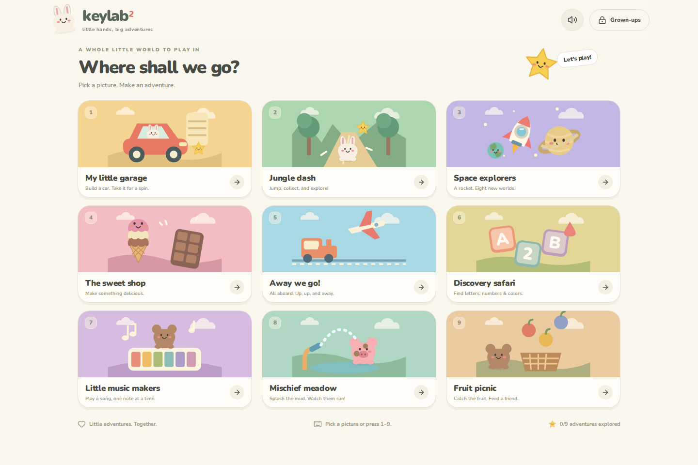

# Keylab 2

**Little hands, big adventures.**

A picture-led playground where a child chooses what to make, where to go, and what to discover. Nine complete, forgiving games with big touch controls, useful keyboard input, original illustrations, gentle music, and a visible way home.

**[Play Keylab 2 →](https://iowa69.github.io/keylab2/)**



## Pick a picture. Make an adventure.

| Adventure               | What the child makes happen                                                                                                                              |
| ----------------------- | -------------------------------------------------------------------------------------------------------------------------------------------------------- |
| **My little garage**    | Choose a car body, paint, and wheels. Drive the finished car, collect stars, and deliver a parcel to a friend.                                           |
| **Jungle dash**         | Steer and jump through a real 3D toy world. Five stars open a rainbow gate to jungle, candy, and moon adventures. Bumps bounce; they never end the game. |
| **Space explorers**     | Pick one of eight planets, collect three fuel stars, and send a rocket to visit it. Fill a little planet passport.                                       |
| **The sweet shop**      | Build a three-scoop ice cream or pour a chocolate bar. Decorate it and share it with a hungry friend.                                                    |
| **Away we go!**         | Choose a train or plane, board three animal friends, and take each to a different destination.                                                           |
| **Discovery safari**    | Match illustrated letters, count real pictured objects, and discover colors. Complete pages of a picture album.                                          |
| **Little music makers** | Play familiar traditional melodies one note at a time, listen to them, or make your own tune on the color piano.                                         |
| **Mischief meadow**     | Aim a water hose at three muddy friends. Wash off their mud, watch them scamper, and make a fresh puddle.                                                |
| **Fruit picnic**        | Catch a pictured order of strawberries, oranges, or blueberries. Serve the basket to Bear and start the next picnic.                                     |

Every game is available from the start. A local checkmark remembers an adventure the child has completed; it never locks or sells anything. Home is always in reach. No losing lives, countdown pressure, account, purchase, advertisement, or video popup.

### Controls

- **Choose:** tap a picture, click, or use keys **1–9** on the home screen. Arrow keys navigate focused game cards; Tab and Enter work too.
- **Play:** large picture buttons, taps, holds, and drags. Ordinary keyboard presses always give a useful action in a game. The runner and vehicles also provide directional controls.
- **Switch:** the house button returns to all nine games.
- **Sound:** the speaker button toggles sound immediately. The games still work silently.
- **Settings:** hold the lock button for **2.5 seconds**, with a pointer or Space/Enter. A brief tap does not open settings.

The default **Little explorer** mode adds help with matching, catching, and steering. **I can do it!** leaves more of the aiming and matching to the child. The artwork, pictured goals, and repeated actions carry the game; reading is optional. Shared play with a grown-up is encouraged.

## Grown-up settings

Choose assistance, volume, calmer motion, stronger control outlines, and an optional rest after 5, 10, or 15 minutes of active game time. The game pauses in settings, at a rest reminder, and when the tab is hidden. Time spent choosing games or in settings does not count. A grown-up starts fresh playtime after a reminder.

System reduced-motion preferences automatically enable calmer play. Fullscreen can be requested from settings where supported; Add to Home Screen is useful on phones and tablets. A website cannot lock browser or operating-system shortcuts.

The tunes are locally synthesized performances of **Twinkle, Twinkle, Little Star**, **Mary Had a Little Lamb**, and **Row, Row, Row Your Boat**. Guided piano play advances the melody with every key; free play gives each key a different note. Spoken hints use an installed local English voice when one is available. No audio recordings or remote speech services are needed. Start with your device volume low.

## Offline and privacy

The production app precaches all games, the 3D engine, illustrations, icons, and bundled fonts. Open it once online and wait for **Ready for offline adventures** in settings. It can then reload and play offline. Preferences and a small collection of completed-adventure stamps stay in local storage on this device.

No analytics, account, microphone, camera, cookies, remote fonts, or third-party runtime requests. The hosting provider receives ordinary page requests when the website is loaded online.

Updates install in the background without forcing an active game to reload. Reopen or refresh the app to use an installed update; settings also shows a refresh button when an update is detected. When upgrading from an old version, let it finish updating, then close and reopen the app.

## Develop and check

Requires Node.js 22.12+ or 24+ and npm.

```bash
npm ci
npm run dev
```

```bash
npm test
npm run build
npx playwright install chromium
npm run test:e2e
npm run format:check
```

Browser tests use the production preview, so build first. Service workers are disabled in development. Test offline behavior in the production preview on localhost or over HTTPS.

React handles the game chooser and illustrated games. Three.js renders Jungle dash, using procedural geometry, bounded scene objects, and a capped pixel ratio. A playable illustrated fallback uses the same runner model if WebGL is unavailable. Animation loops stop advancing while paused and release resources on game switches. Web Audio produces bounded, short musical feedback.

```text
src/
  App.tsx                 Child-owned chooser, navigation, pauses, saved stamps
  adventure/
    Art.tsx               Original reusable SVG characters and nine game pictures
    *Game.tsx             Purposeful game loops, pictures, and interaction
    VehicleGames.tsx      Garage building/driving and train/plane journeys
    runnerModel.ts        Independent 3D runner simulation
    ParentPanel.tsx       Protected preferences, rest, fullscreen, offline state
    audio.ts              Local tones and optional local-voice hints
    useGameKeys.ts        Shared forgiving keyboard handling
    usePlayTimer.ts       Scene timers that retain time across pauses
  playroom/
    settings.ts           Validated preferences and older-version migration
    offline.ts            Service-worker installation and updates
tests/playroom.spec.ts    Desktop/mobile browser acceptance tests
```

Automated checks cover real game completion and replay, keyboard after pointer input, navigation, pauses including moving artwork, preferences, small screens, and offline reloading. Chromium runs in desktop and mobile emulation. These checks are not hands-on usability sessions with children, nor physical iOS/Android testing.

## Design and publishing

See [the game design notes](docs/GAME_DESIGN.md) for the picture-first interaction rules and each game's purpose. Pushes to `main` run formatting, unit tests, a production build, and desktop/mobile browser checks before publishing to GitHub Pages. No backend or secrets are required. Relative assets support the `/keylab2/` repository path.

## Credits and license

A standalone successor inspired by [Keylab](https://github.com/iowa69/keylab) and direct-play toddler toys. Original SVG illustrations and procedural 3D artwork; Nunito fonts; Lucide interface icons; React, Three.js, and Vite PWA.

Planet order and simple facts follow [NASA's planetary overview](https://science.nasa.gov/solar-system/planets/). The toy solar system is deliberately not to scale; the rocket visits planets rather than depicting landings on gas or ice giants. Music uses traditional public-domain melodies, without third-party recordings.

Copyright © 2026 Giovanni Lorenzin. All rights reserved. Made with love for Gabriel. See [LICENSE](LICENSE). Third-party packages retain their own licenses; Nunito uses the SIL Open Font License.
