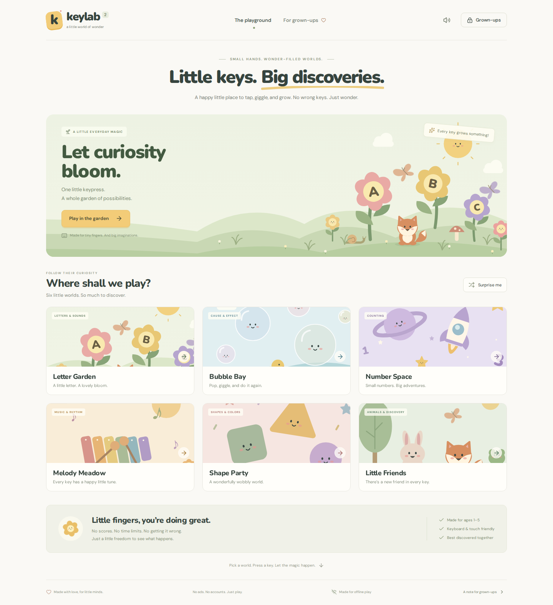

# Keylab 2

**Little keys. Big discoveries.**

A gentle, illustrated keyboard playground for little explorers, around ages 1–5. Pick a world, press a key, and see what happens. No scores, no wrong answers, no accounts, no ads.

**[Come and play →](https://iowa69.github.io/keylab2/)**



A new, standalone companion to [Keylab](https://github.com/iowa69/keylab), with original vector illustrations, a storybook palette, touch controls, and little challenges.

## Six little worlds

| World          | Explore                                                                | Little challenge                          |
| -------------- | ---------------------------------------------------------------------- | ----------------------------------------- |
| Letter Garden  | Letters grow into colorful flowers. Optional spoken letters and words. | Find the highlighted letter.              |
| Bubble Bay     | Make floating bubbles and tap to pop them.                             | Make a small collection of bubbles.       |
| Number Space   | Press 1–9 to launch exactly that many smiling stars.                   | Find a number from 1–5.                   |
| Melody Meadow  | Every key makes a gentle pentatonic note.                              | Play a little melody, one note at a time. |
| Shape Party    | Circles, triangles, squares, stars, and hearts come to life.           | Make a handful of happy shapes.           |
| Little Friends | Discover foxes, bunnies, bears, cats, frogs, and owls.                 | Invite a few friends to the meadow.       |

Unexpected keys still make something lovely. There is no failure state. Free play has no progress counters or rewards to chase.

## For grown-ups

- **Keyboard and touch:** physical keys, on-screen keys, and tapping the scene all work.
- **Gentle sound:** synthesized audio, a restrained master volume, a compressor, and bounded voices. Start with your device volume low; software cannot guarantee a safe physical loudness.
- **Calm mode:** stops decorative movement and confetti. System reduced-motion preferences are always respected.
- **Optional narration:** uses an installed, local English speech voice. If none is available, the app remains silent; it never falls back to a network voice.
- **Optional breaks:** 5, 10, or 15 minutes of visible, active play before a soft stretch reminder. Hidden tabs pause play.
- **Grown-up settings:** hold for three seconds, then answer a simple arithmetic question. Preferences stay in local storage on the device.
- **Fullscreen:** available from the playroom where supported. Escape pauses play. Browser and operating-system shortcuts cannot all be intercepted; this is a playground, not kiosk software. Best enjoyed together.
- **Offline:** the production build precaches its code, illustrations, app icons, and locally bundled fonts. Wait for “Ready for offline play” on the first visit. Add to the home screen using your browser's install option.
- **Privacy:** no analytics, cookies, accounts, advertising, camera, microphone, remote fonts, or third-party runtime requests. The hosting provider still receives ordinary requests when the website is loaded online.

## Run locally

Requires Node.js 22.12+ or 24+ and npm.

```bash
npm ci
npm run dev
```

Open the URL Vite prints (normally `http://localhost:5173`).

```bash
npm run build       # Type-check and build into dist/
npm run preview     # Serve the production build, including offline support
npm test            # Input, challenge, and settings unit tests
npx playwright install chromium
npm run test:e2e    # Desktop and mobile browser tests; build first
```

Service workers are disabled in development. Test offline behavior using the production preview on localhost or an HTTPS deployment.

## Implementation

React · TypeScript · Vite · original SVG illustrations · Web Audio · local Web Speech · Vite PWA · locally bundled Nunito and DM Sans · Lucide icons.

The production app has no backend and requires no secrets or environment variables. The JavaScript entry is approximately 87 KB gzipped. Animations use CSS transforms. Live toys are capped at 36, repeat events are ignored, and old toys expire. Sound and speech requests are throttled to prevent queues during keyboard smashing.

```text
src/
  App.tsx                      Home and app preferences
  components/Art.tsx           Original illustrated characters and worlds
  components/Playground.tsx    Input, activities, challenge progression, pause
  components/ParentDialog.tsx  Grown-up gate and settings
  lib/audio.ts                Bounded synthesized sound and local narration
  lib/worlds.ts                World definitions, challenges, input normalization
  styles.css                   Responsive design and reduced-motion behavior
tests/play.spec.ts             Desktop/mobile browser acceptance tests
```

Browser tests cover every world, touch controls, target progression, exact number counts, bubble popping, rapid input, pause, settings persistence, the break timer, responsive overflow, reduced motion, and a real offline reload. Tests run in Chromium with desktop and mobile device emulation; Safari and Firefox have not been separately verified.

## Deployment

The included GitHub Actions workflow builds and tests the app, then deploys `dist/` to GitHub Pages on pushes to `main`. Set **Settings → Pages → Source** to **GitHub Actions**. Relative asset paths support both a repository subpath and a regular static host. Production updates wait for a fresh session instead of reloading a child's active play.

## License and credits

Copyright © 2026 Giovanni Lorenzin. All rights reserved. Made with love for Gabriel.

Original code and illustrations in this project are governed by [LICENSE](LICENSE). Third-party packages retain their own licenses: React, Vite, Lucide and related tooling use their respective open-source licenses; Nunito and DM Sans are distributed under the SIL Open Font License. See the packages installed in `node_modules` for license text.
